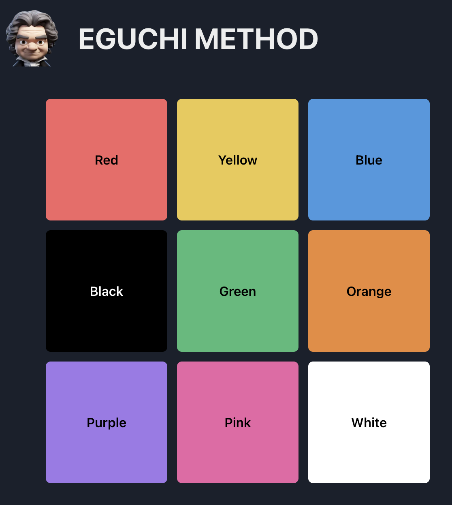
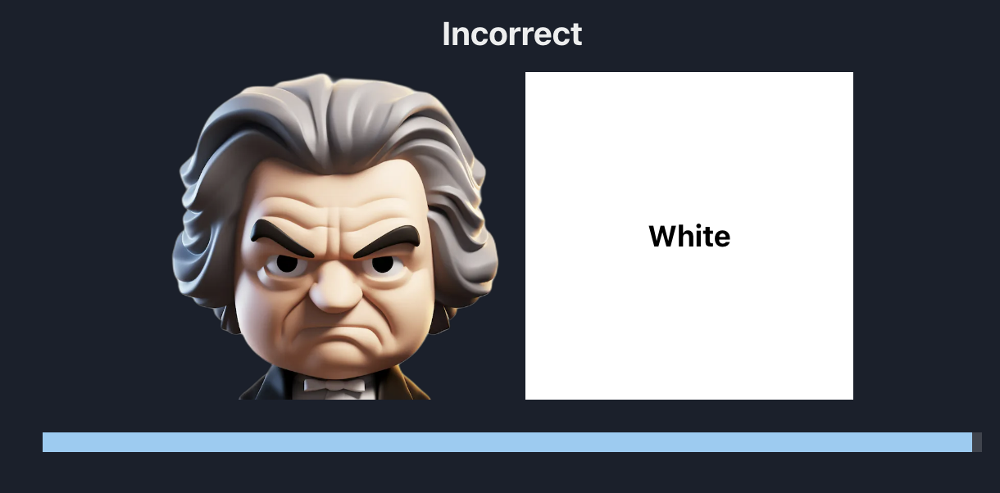

# Eguchi

The Eguchi Method is an obscure method that, according to a scientific study, has a 90% success rate in teaching children aged 2-6 absolute pitch (also known as perfect pitch).

The Eguchi method teaches children to identify chords by associating them with colors. In the literature, the trainer plays the chord on the piano and the child holds up a colored flag representing the chord. For example, the trainer plays C-major, and the child holds up a red flag.

After identifying 9 "white key" chords with perfect accuracy, the child is then introduced to "black key" chords and taught to break down the chords into individual notes. According to the research, this results in absolute pitch abilities that needs a small amount of regular practice to maintain.

I could not find any software built in the last 10+ years that is based on this method, so I put together this simple web app to try it with my own children. This very basic initial version does not implement any progression or tracking, but I may add these features in the future.

A child may practice the Eguchi method by working directly on the app, or if the parent has a piano handy, you can turn off the sounds and show the chords on a piano on the screen to train in the traditional way.

